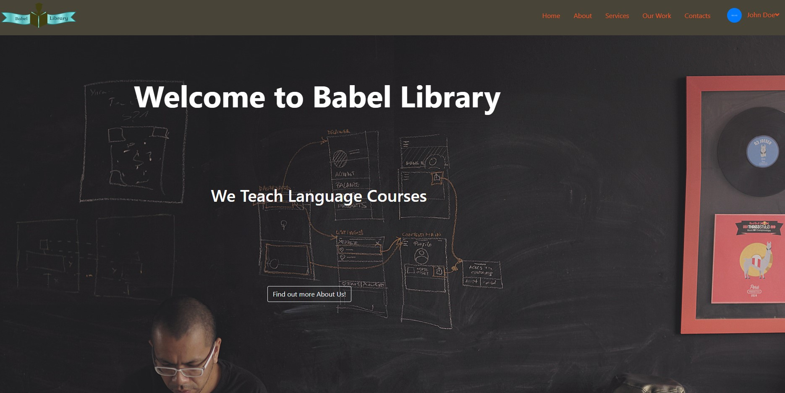

This project was bootstrapped with [Create React App](https://github.com/facebook/create-react-app).

# Babel Library

A Language School Platform

*WORK IN PROGRESS*

# **Our Landing Page**

## Table of Contents

- [Description](#Description)
- [User Stories](#User)
- [Installation](#Installation)
- [Link](#Link) 
- [License](#License)
- [Contributors](#Contributors)
- [Test](#Test)
- [GitHub Info](#GitHub) 

## Description
This is a *work in progress*, but we expect to have the following functionality:

A fully secure education platform for language students to take their courses online with dedicated and qualified teachers. The classes will be held on secure zoom channels, and students will have classes with other students in their own age range and langauge level. Students will have homework and corresponding texts to follow to help with their writing and grammar skills.

## User Stories
*Work in Progress*

Client Administrator would be able to alter information on the home page, add access to login for teachers and students, be able to match teachers and students into classes, access to all data, etc.

Client Student would have access to their homework, class resources, profile, grades, class schedule/calendar with due dates, have access to google classroom, access to direct message board to teacher and class, etc.

       

## Installation

        npm install 

## Link

<!-- - [Deployed App in Heroku](http://gamer-dash.herokuapp.com/) -->

## License

<!--  -->

## Contributors

<!--  -->

## Test

Tests: A work in progress.